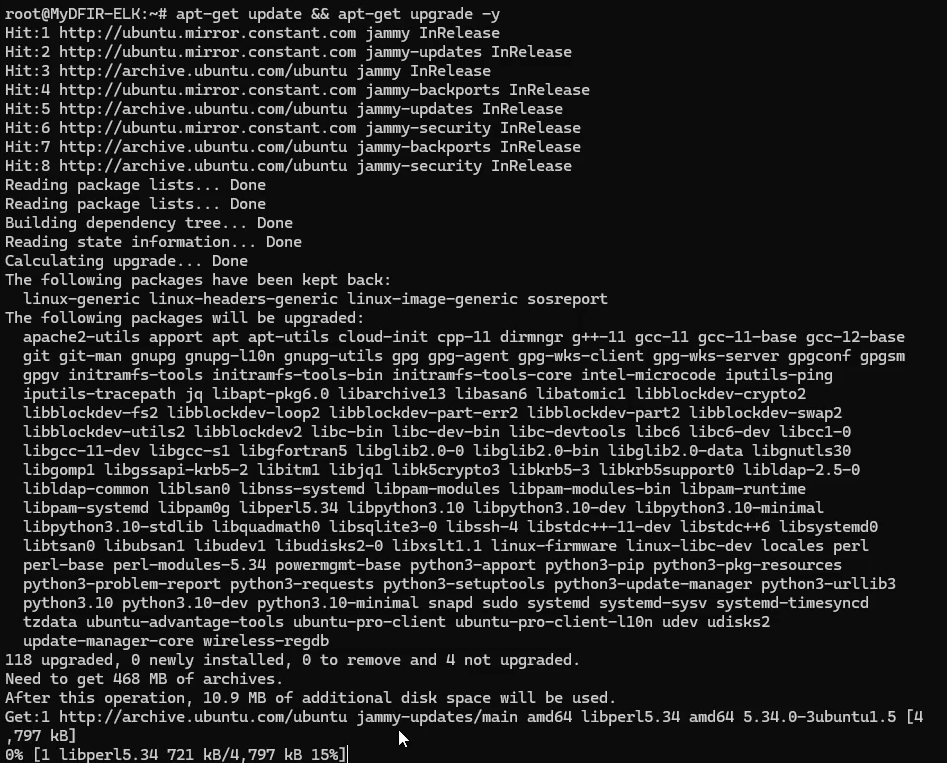

# 🟢 Elasticsearch & Kibana Deployment — **Vultr Cloud**

This project demonstrates how I deployed and configured **Elasticsearch** and **Kibana** on an **Ubuntu 22.04 server** hosted on **Vultr**.  
The goal is to simulate a **Security Information & Event Management (SIEM)** environment for log collection, monitoring, and visualization.

---

## **📌 Project Overview**
- **Cloud Provider:** Vultr  
- **Operating System:** Ubuntu 22.04 LTS  
- **Tools Installed:** Elasticsearch & Kibana  
- **Use Case:** Log ingestion, monitoring, and visualization  
- **Portfolio Type:** SOC Analyst / IT Technician / Cybersecurity  

---

## **📂 Lab Architecture**

| **Component**      | **Purpose**                | **OS / Tool** |
|--------------------|---------------------------|---------------|
| Vultr Cloud Server | Host environment          | Ubuntu 22.04 |
| Elasticsearch      | Data indexing & storage  | v8.x.x |
| Kibana             | Visualization dashboard  | v8.x.x |
| Analyst Machine    | Access & monitoring      | Windows 11 |

📸 *Screenshot Placeholder: Architecture Diagram*  


---

## **⚡ Prerequisites**
Before starting, make sure you have:
- A **Vultr account** with **VPC 2.0** enabled  
- A deployed **Ubuntu 22.04 server**  
- Opened **ports 9200** (Elasticsearch) & **5601** (Kibana) in Vultr firewall  
- SSH access via PowerShell, Terminal, or PuTTY  

---

## **🛠️ Installation & Configuration**

### **Step 1 — Deploy Server on Vultr**
1. Go to [Vultr Dashboard](https://my.vultr.com/).  
2. Deploy an **Ubuntu 22.04 x64** instance.  
3. Assign a hostname and enable **VPC 2.0 networking**.  

📸 *Screenshot:*  


---

### Step 2 — Update the Server
```bash
sudo apt update && sudo apt upgrade -y
```

📸 *Screenshot:*  


### Step 3 — Install Elasticsearch
```bash
wget https://artifacts.elastic.co/downloads/elasticsearch/elasticsearch-8.x.x-amd64.deb
sudo dpkg -i elasticsearch-8.x.x-amd64.deb
```
📸 *Screenshot:*  


Step 4 — Configure Elasticsearch
```bash
sudo nano /etc/elasticsearch/elasticsearch.yml
```
Inside the config file, I made the following changes:

Changed network.host to my Elasticsearch server’s IP address (removed the # to enable it).

Removed the # before http.port: 9200 to enable the HTTP port.

network.host: 144.*.*.*
http.port: 9200

📸 *Screenshot:*  


### Step 5 — Secure Access with Vultr Firewall Rules
To improve security, I updated my **Vultr Firewall Group** so that only **my IP address** could connect to the server:

- **Port 22 (SSH)** → Allowed from my IP only
-  **Port 9200** → Elasticsearch  
- All other ports → Blocked by default  

This prevents unauthorized access while I continue configuring Elasticsearch and Kibana.

📸 *Screenshot:*  


### Step 6 — Start & Enable Elasticsearch
```bash
systemctl daemon-reload
systemctl enable elasticsearch.service
systemctl start elasticsearch.service
systemctl status elasticsearch.service
```
📸 *Screenshot:*  


### Step 7 — Install Kibana
```bash
wget https://artifacts.elastic.co/downloads/kibana/kibana-8.x.x-amd64.deb
dpkg -i kibana-8.x.x-amd64.deb
```

📸 *Screenshot:*  


### Step 8 — Configure Kibana
```bash
nano /etc/kibana/kibana.yml


Inside the config file, I made the following changes:

Changed server.host to the public IP of my Vultr VM (removed the # to enable it)

Removed the # before server.port: 5601 so it listens on the default port


server.host: 144.*.*.*
server.port: 5601
```
📸 *Screenshot:*  


### Step 9 — Start & Enable Kibana
```bash
systemctl daemon-reload
systemctl enable kibana.service
systemctl start kibana.service
systemctl status kibana.service
```
📸 *Screenshot:*  


### **Step 10 — Generate Kibana Enrollment Token**
To pair Kibana with Elasticsearch, generate a one-time enrollment token:

```bash
# Path may vary slightly by package/version; this is the common location
cd /usr/share/elasticsearch/bin
sudo ./elasticsearch-create-enrollment-token --scope kibana
Copy the token shown in the terminal.
```
📸 *Screenshot:*  


### Step 11 — Adjust Firewall (Cloud + Host)
```bash
I needed to reach Kibana on port 5601 from my workstation.

Vultr firewall (cloud):

(Temporary) I allowed TCP from my IP to reach the server.

(source = my IP only):

22/tcp (SSH)

5601/tcp (Kibana)

9200/tcp (Elasticsearch)
```
📸 *Screenshot:*  


```bash
Ubuntu UFW (host):
ufw allow 5601
(allow any connections to the 5601) 
```
📸 *Screenshot:*  


### Step 11 — Open Kibana and Complete Enrollment\
```bash
Open your browser and go to Kibana:


http://<server-public-ip>:5601


1. **Paste the enrollment token** from Step 10 when prompted.  

2. Next, Kibana will request a **verification code**.  
   Run the following command to generate it:
   ```bash
   /usr/share/elasticsearch/bin/elasticsearch-create-enrollment-token -s kibana
   /usr/share/elasticsearch/bin/kibana-verification-code


Copy the code and paste it into the prompt.

After verification, you’ll be prompted to log in.

Username: elastic

Password: This was provided during Elasticsearch installation under “Security auto-configuration information.”

If you lost or forgot the password, reset it with:

/usr/share/elasticsearch/bin/elasticsearch-reset-password -u elastic

Once authenticated, you’ll reach the Kibana dashboard.
```
📸 *Screenshots:*  
  
  
  


